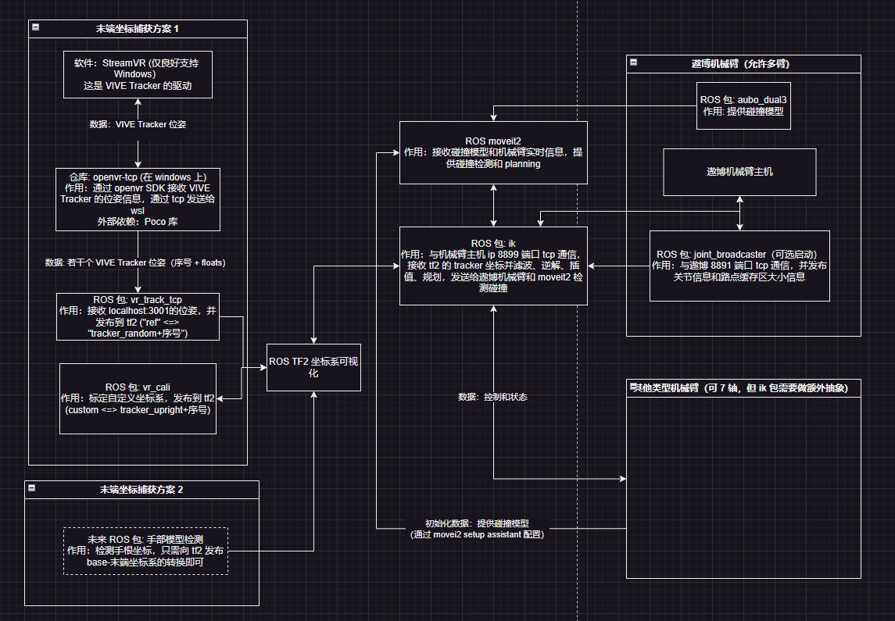

# 各包功能概览

- aubo 提供 urdf (不发送)
- aubo_description 提供 kde（aubo 官方指定）
- aubo_dual3 提供 moveit2 配置
- bringup 提供 launch 文件
- vr_cali 标定动作. in: tf(ref, tracker_random) out: tf(custom, tracker_upright)
- vr_track_tcp 接收 windows 发来的 tracker 坐标. in: tcp(localhost: 3001) out: tf(ref, tracker_random)
- ik_kdl in: load urdf, tf(tracker_upright, custom) | out(tcp: 192.168.38.128:8899 (to vm))
- windows 的 openvr_tcp: in: vr sdk | out: tcp(wsl:3001)

# 启动顺序

注意：所有 ubuntu 终端运行下述命令前执行 `cd ros_ws && source install/setup.bash`

## ubuntu 第一个终端：Tracker 通信与标定程序：

```
ros2 launch bringup cali.py
```

## windows 终端：运行与 SteamVR 的通信

```
./install/bin/opencv-tcp.exe
```

## ubuntu 第二个终端: 运行 moveit2

```
ros2 launch aubo_dual3 demo.launch.py
```

## ubuntu 第三个终端: 标定

标定实现方式: `src/fast_control/scripts/j.bash` 中的函数发布 ros2 topic 与 vr_cali 节点进行通信。

```bash
j.p0 0 # 将 0 号 vr tracker 的当前 position 作为自定义坐标系 (custom) 的原点
j.px 0 # 设置 x 轴
j.py 0 # 设置 y 轴
j.cali # 计算自定义坐标系并发布
j.up 0 # 标定 0 号 vr tracker 的 orientation

j.s 1 # 将当前 1 个 tracker 的标定写入 ~/.teleop/cali1.yaml 文件（适用于仅使用一个 tracker 的情况）

# 如要标定两个 tracker 则需
j.up 1 # 标定 1 号 vr tracker 的 orientation
j.s 2 # 将当前 2 个 tracker 的标定写入 ~/.teleop/cali2.yaml 文件

# 上一次标定好的所有数据可通过 j.l 加载
j.l 1 # 加载 cali1.yaml。如有两个 tracker 则 `j.l 2`
```
 
## ubuntu 仍旧第三个终端: 启动 ik node

```
colcon build --packages-select ik bringup && ros2 launch bringup moveit.py
```

## （可选）启动 joint_broadcaster

开启此 node 要求 aubo 驱动更新，下载此链接或联系遨博开发人员。 https://pan.quark.cn/s/ea15e9651133

即使不启动本节点，ik node 也会自行估计相关信息。

```
colcon build --packages-select ik && ros2 run ik ik_joint_broadcaster_exe
```

# FAQ

## 坐标系问题

要求 ref 系下 tracker_random 原点的位置?

获取 tracker_random 表示转 ref 表示的 R, T: (x_ref = R * (x_trakcer_random) + T)。那么 T 也是要求的原点位置

ref is parent & target; tracker_random is child & source

## 坐标系规定

- 标定时，手向前伸为 x 轴，向左为 y 轴
- ik 函数（以及 urdf model）中，x 轴为桌面左（桌前定义为朝向 uji 其他机械臂工作区），y 轴为桌面后

## 如何切换单臂 / 多臂？

在 src/fast_control/bringup/launch/moveit.py 中，将下方 node 注释掉就可开关手臂。注意检查 `src/fast_control/ik/config/ik_moveit_left.yaml` 参数表中通信 ip。

```py
    return LaunchDescription([
        ik_moveit_left_node,
        ik_moveit_right_node
    ])
```

## 如何配置新机械臂？

获取机械臂的 urdf 并使用 moveit2 setup assistant 生成完整 moveit2 包。配置方式见: https://blog.csdn.net/qq_27865227/article/details/126860096



# todo:

- [x] angle interpolation seems wrong.
- [x] 电机发的是两圈的，注意内部处理。
- [x] 机械臂开机怎么开，更新机械臂驱动，加速 macsize 获取
- [x] 仿真模式和真机模式都有很大延迟，奇怪的是，即使仿真时控制 mac 调小，延迟依然小不下来，不及以前。- 速度 / 加速度插值有问题（线性插值加速度导致加速度太小了，估计哪里写挂了）。优化了插值方法以后变好了。
- [x] 透传函数时不时阻塞一两百毫秒，检查出来透传到实机不管动不动都有 0.2% 几率阻塞 100~200ms，虚拟机没有此问题，换网线没用。 - 通过遨博的新驱动解决了此问题
- [x] 插值过程可能碰撞
- [x] joint_states 同步到 moveit 场景中，增加一个机械臂，进行碰撞预测。

# 涉及付款相关

无

# 涉及公司资产

- 电脑主机 1 台 13th Gen Intel(R) Core(TM) i7-13790F / RTX 2060 SUPER
- 显示器 1 台
- 键盘 1 个
- 鼠标 1 个
- 遨博机械臂 i5 - 2 台
- HTC VIVE 定位器 2 台
- HTC VIVE 跟踪器及接收器 2 个
